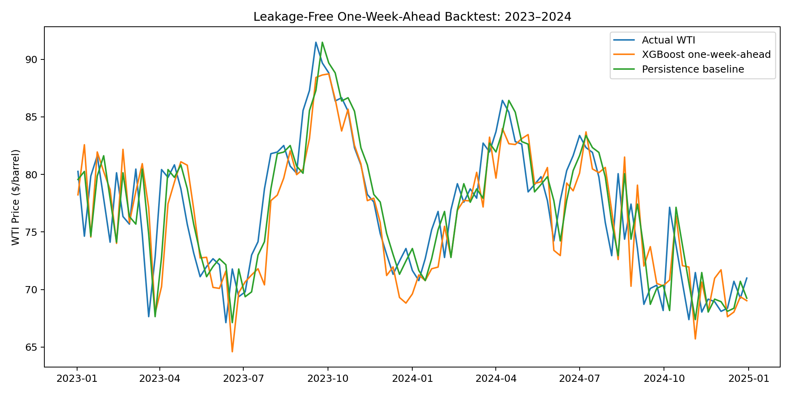
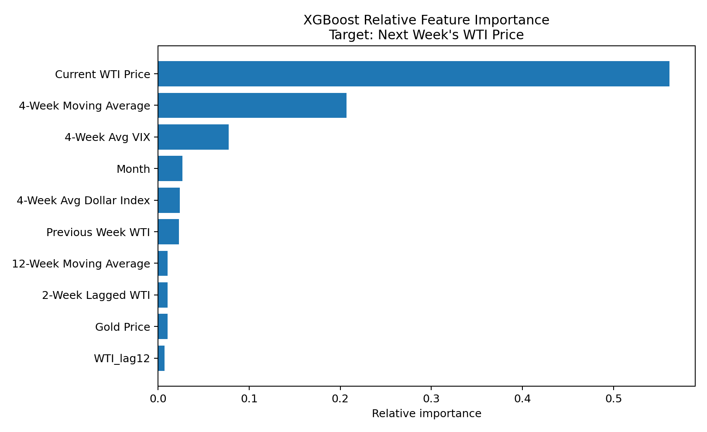
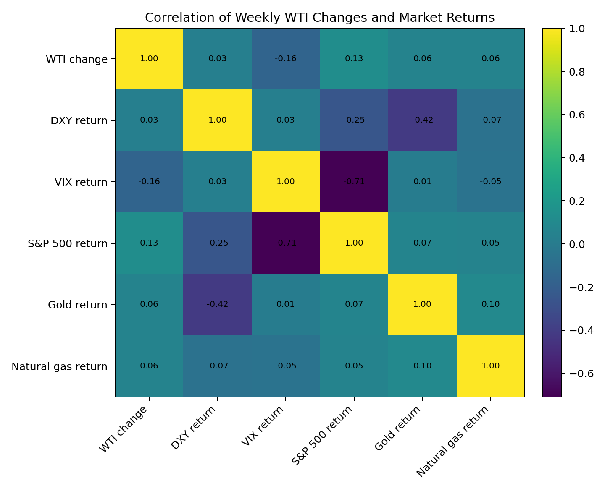
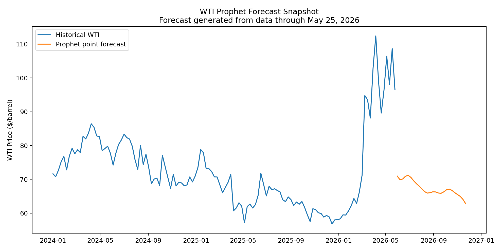
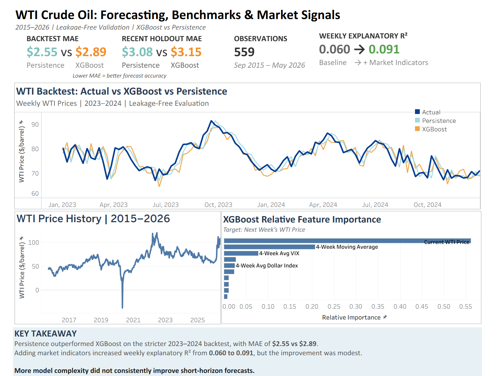

# WTI Crude Oil Price Analysis & Forecasting

### Macroeconomic Associations, Leakage-Free Validation, and Time-Series Forecasting (2015–2026)

## Overview

This project studies WTI crude oil prices alongside financial-market indicators and monthly macroeconomic variables. The analysis separates **explanatory relationships** from **forecasting**, uses time-ordered validation, and benchmarks machine-learning performance against a simple persistence forecast.

**Research Question:**  
How are macroeconomic and financial-market conditions associated with movements in WTI crude oil prices, and how much explanatory or predictive information do they add beyond recent oil-price dynamics?

---

## Data

The checked-in snapshot contains **559 weekly observations from September 14, 2015 through May 25, 2026**.

| Source | Variables | Frequency Used |
|---|---|---|
| Yahoo Finance / `yfinance` | WTI Crude Oil, U.S. Dollar Index, VIX, S&P 500, Gold, Natural Gas | Weekly |
| FRED / U.S. Bureau of Labor Statistics | CPI (`CPIAUCSL`) | Monthly |
| FRED / Federal Reserve | Effective Federal Funds Rate (`FEDFUNDS`) | Monthly |

**FRED Sources:**  
- https://fred.stlouisfed.org/series/CPIAUCSL
- https://fred.stlouisfed.org/series/FEDFUNDS

Monthly CPI and Federal Funds data are kept at their native monthly frequency for econometric analysis. They are **not duplicated into weekly observations for predictive modeling**.

---

## Key Findings

- **Short-run WTI movements show mean reversion in the weekly sample.** In the HAC/Newey-West regression, the coefficient on the prior week's WTI change is approximately **-0.235** (`p = 0.021`).

- Adding weekly DXY, VIX, S&P 500, Gold, and Natural Gas returns increases model R² from approximately **0.060 to 0.091**. The improvement is modest, so these variables should not be described as strong standalone predictors.

- In the most recent chronological 20% holdout, the leakage-free one-week-ahead XGBoost model achieved **R² = 0.850** and **MAE = $3.15/barrel**. A persistence benchmark (`next week's price = this week's price`) achieved **R² = 0.841** and **MAE = $3.08/barrel**. XGBoost therefore did **not** improve MAE on that holdout.

- In a stricter 2023–2024 backtest, XGBoost achieved **R² = 0.572** and **MAE = $2.89/barrel**, versus **R² = 0.689** and **MAE = $2.55/barrel** for the persistence benchmark. This reinforces that the ML model does not provide a stable forecasting advantage over a simple baseline.

- At the monthly frequency, adding financial and macroeconomic variables raises adjusted R² to approximately **0.216**. Monthly CPI inflation has a strong contemporaneous association with WTI movements in this sample, but the analysis does **not** interpret that association as causal.

- The Prophet output is retained as an **exploratory 26-week forecast snapshot generated from data through May 25, 2026**. It is not presented as a causal model or a guaranteed price forecast.

---

## Methodology

### 1. Data Quality and Frequency Alignment

- Weekly market series are analyzed at weekly frequency.
- CPI and the Effective Federal Funds Rate remain monthly for macroeconomic regressions.
- Missing values, duplicate dates, and chronological ordering are checked before modeling.

### 2. Explanatory Regression Analysis

Weekly WTI dollar changes are modeled using:

- Prior-week WTI change
- DXY return
- VIX return
- S&P 500 return
- Gold return
- Natural Gas return

OLS regressions use **HAC/Newey-West standard errors** to reduce sensitivity to heteroskedasticity and serial correlation.

A separate monthly specification adds monthly CPI inflation and the change in the Effective Federal Funds Rate.

### 3. Leakage-Free XGBoost Forecasting

The forecasting target is **next week's WTI price**. Every feature is available at week *t* or earlier; the model never uses the target week's WTI value in a rolling average or other feature.

**Features include:**

- Current and lagged WTI prices
- 4-, 12-, and 26-week WTI moving averages
- WTI momentum
- DXY and VIX rolling averages
- Weekly market returns
- Month and quarter

Validation is chronological, not random. XGBoost is evaluated against a **persistence benchmark** rather than judged on R² alone.

### 4. Prophet Forecast

Prophet is used separately for an exploratory forward price path based on historical WTI. The forecast is intentionally kept separate from the explanatory regression and one-step-ahead XGBoost evaluation.

---

## Visualizations

### Leakage-Free Backtest



### XGBoost Relative Feature Importance

Feature importance is shown as **relative model importance**, not as "percent of variance explained" and not as proof of causality.



### Weekly Market Correlations

The heatmap uses **weekly WTI changes and market returns**, rather than correlations among trending price-level series.



### Prophet Forecast Snapshot



---

## Tableau Dashboard

The interactive Tableau dashboard summarizes the project's main analytical findings, including:

- Leakage-free XGBoost vs. persistence backtesting
- Recent holdout and 2023–2024 backtest MAE comparisons
- Historical WTI price trends from 2015–2026
- Weekly explanatory R² improvement from 0.060 to 0.091
- XGBoost relative feature importance

The dashboard uses the corrected exports in the `data/` folder and is aligned with the methodology and results reported in this repository.

**Key takeaway:** A more complex forecasting model did not consistently outperform a simple persistence benchmark, reinforcing the importance of leakage-free validation, baseline comparisons, and honest out-of-time evaluation.

**Tableau Public:**  
[Interactive WTI Dashboard](YOUR-DIRECT-TABLEAU-DASHBOARD-LINK)

### Dashboard Preview



---

## Repository Structure

```text
wti-crude-oil-analysis/
├── README.md
├── WTI_Crude_Oil_Price_Analysis.ipynb
├── requirements.txt
├── data/
│   ├── market_weekly_snapshot.csv
│   ├── macro_monthly_snapshot.csv
│   ├── macro_normalized.csv
│   ├── regression_results.csv
│   ├── backtest_tableau.csv
│   ├── feature_importance_clean.csv
│   └── combined_forecast.csv
└── charts/
    ├── backtest_final.png
    ├── feature_importance_final.png
    ├── correlation_heatmap_final.png
    └── prophet_forecast_2026.png
```

---

## Reproducibility

The notebook reads the checked-in data snapshots by default so the reported results can be reproduced without relying on changing market-data downloads.

It also includes an optional refresh section for pulling a new market snapshot with `yfinance` and current FRED data.

---

## Limitations

- Statistical association does **not** establish causality.
- WTI futures experienced an extreme negative-price event in April 2020, which can materially affect model estimates and forecast metrics.
- Monthly macroeconomic releases are not available at weekly frequency and should not be treated as fresh weekly information.
- Tree-based feature importance measures contribution to the fitted model; it does not measure economic causality or literal variance explained.
- Short-horizon oil-price forecasting is difficult, and model performance varies across evaluation windows. The persistence benchmark is therefore reported alongside XGBoost.

---

## Tools

**Python:** pandas, NumPy, statsmodels, scikit-learn, XGBoost, Prophet, Matplotlib  
**Visualization:** Tableau Public  
**Data Sources:** Yahoo Finance / `yfinance`, FRED

---

## Author

**Sai Kamala Priya Areti**  
MS Business Analytics — Northeastern University  

[LinkedIn](https://www.linkedin.com/in/priyaareti/) | [GitHub](https://github.com/priyaareti14) | [Tableau Public](https://public.tableau.com/app/profile/priya.areti/vizzes)

