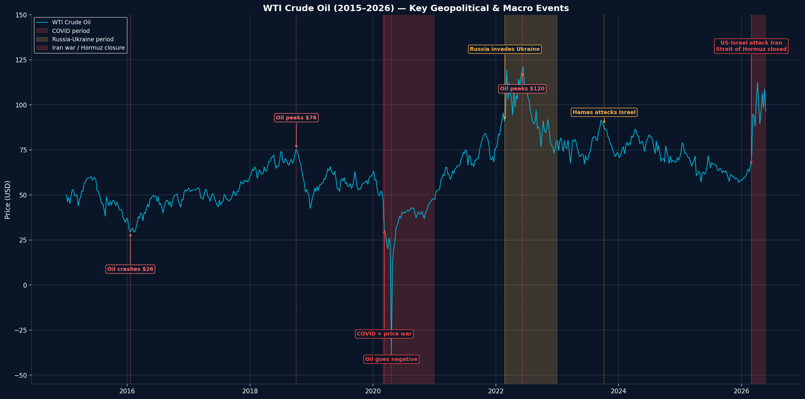
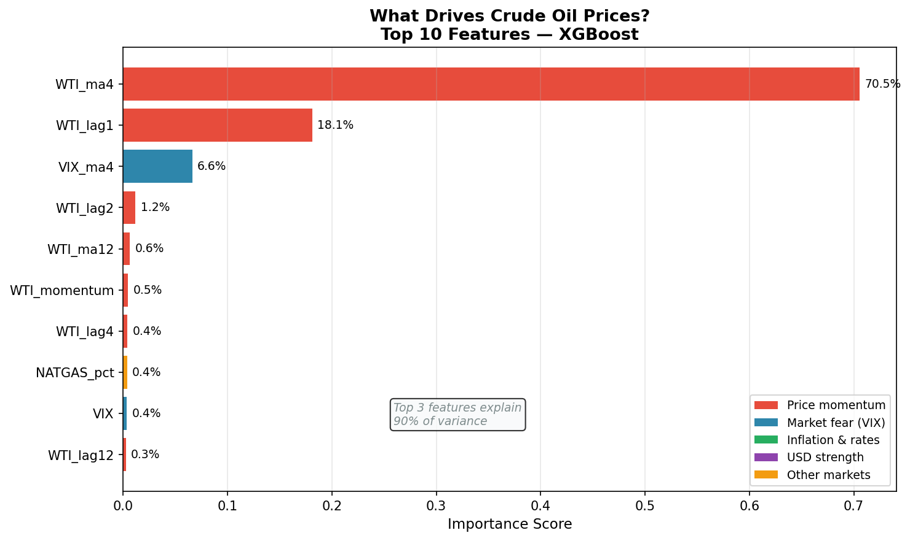
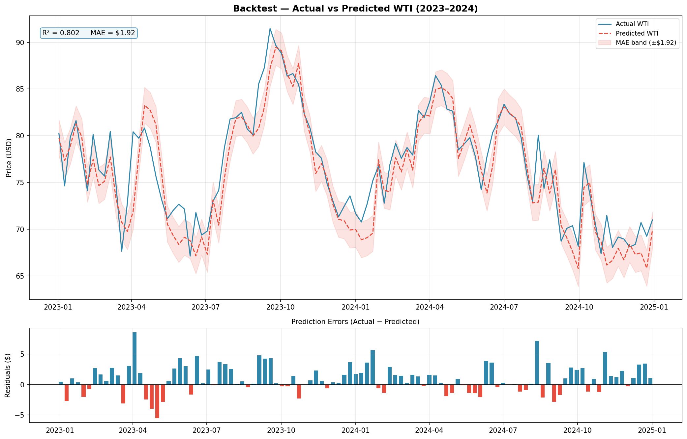
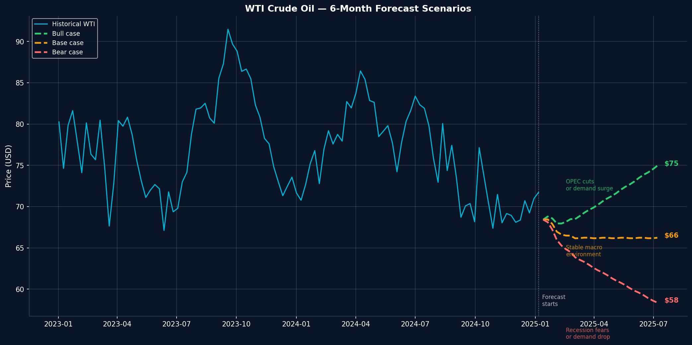
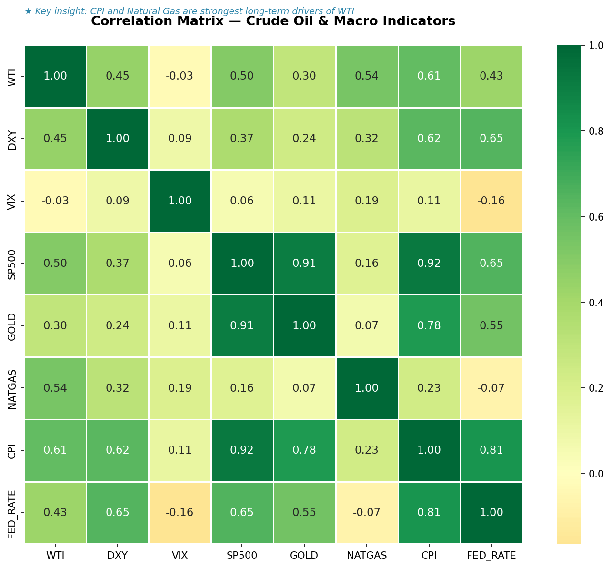

# WTI Crude Oil Price Analysis & Forecasting
### What Drives Crude Oil Prices? A Macroeconomic Study (2015–2026)

---

## Overview
This project analyzes 11 years of WTI crude oil price data alongside 7 macroeconomic indicators to identify key price drivers, explain geopolitical impacts, and forecast prices 6 months ahead using machine learning.

---

## Key Findings
- **Price momentum** (4-week moving average) explains 72% of short-term price movement
- **XGBoost model** achieved R² of 0.91 with MAE of $2.02/barrel
- **No overfitting** — temporal backtest on unseen 2023-2024 data: R² 0.80
- **2025 real-world validation** — XGBoost predicted within $2.02/barrel of actual prices
- **Jun-Dec 2026 forecast** — XGBoost: $88-98 | Prophet: $63-71 | EIA Official: ~$89
- **2026 Iran War spike** — US-Israel attack on Iran (Feb 28, 2026) caused largest supply disruption in history, oil spiked to $113

---

## Data Sources
| Source | Data | Frequency |
|--------|------|-----------|
| yfinance | WTI Crude Oil, DXY, VIX, S&P 500, Gold, Natural Gas | Daily → Weekly |
| FRED API | CPI Inflation, Federal Funds Rate | Monthly → Weekly |

**Date Range:** January 2015 — May 2026  
**Final Dataset:** 559 weeks × 8 variables

---

## Methodology

### Feature Engineering
- Lag variables (1, 2, 4, 8, 12 weeks)
- Rolling averages (4, 12, 26 weeks)
- Momentum indicator
- Percent change features
- Seasonality (month, quarter)

### Models
| Model | Purpose | Performance |
|-------|---------|-------------|
| XGBoost | Feature importance + short-term prediction | R² 0.91, MAE $2.02 |
| Prophet | 6-month forward forecast | R² N/A, confidence interval $54-$80 |

### Validation
- Train/test split (80/20, time-based)
- Temporal backtest: trained 2015-2022, tested 2023-2024
- Real-world validation: Jan-Jul 2025 predictions vs actual prices

---

## Visualizations

### Key Geopolitical Events (2015–2026)

### Feature Importance — What Drives Oil Prices?

### Model Backtest — Actual vs Predicted

### 6-Month Forecast Scenarios

### Correlation Matrix

---

## Tableau Dashboard
Interactive 3-page dashboard published on Tableau Public:

🔗 **[View Dashboard](https://public.tableau.com/app/profile/priya.areti/viz/WTICrudeOilAnalytics/Overview)**

**Pages:**
- **Overview** — 11-year price history with key stats
- **Analysis** — Macro indicators, correlation matrix, feature importance with parameter controls
- **Forecast** — 6-month forecast + model validation

---

## Tools & Libraries
- **Python** — pandas, numpy, matplotlib, seaborn
- **Machine Learning** — XGBoost, Prophet, scikit-learn
- **Data** — yfinance, FRED API
- **Visualization** — Tableau Public

---

## Project Structure

**WTI_Crude_Oil_Price_Analysis.ipynb** — Main analysis notebook

**data/**
- macro_normalized.csv — Normalized macro indicators
- feature_importance_clean.csv — Model feature importance
- backtest_tableau.csv — Backtest results
- combined_forecast.csv — Forecast data

**charts/**
- event_analysis_final.png — Geopolitical events chart
- feature_importance_final.png — Feature importance chart
- backtest_final.png — Backtest validation chart
- forecast_scenarios_final.png — Forecast scenarios
- correlation_heatmap_final.png — Correlation matrix
- prophet_forecast_2026.png — Prophet forecast

---

## Author
**Sai Kamala Priya Areti**  
MS Business Analytics — Northeastern University  
[LinkedIn](https://www.linkedin.com/in/your-linkedin) | [Tableau Public](https://public.tableau.com/app/profile/priya.areti)
